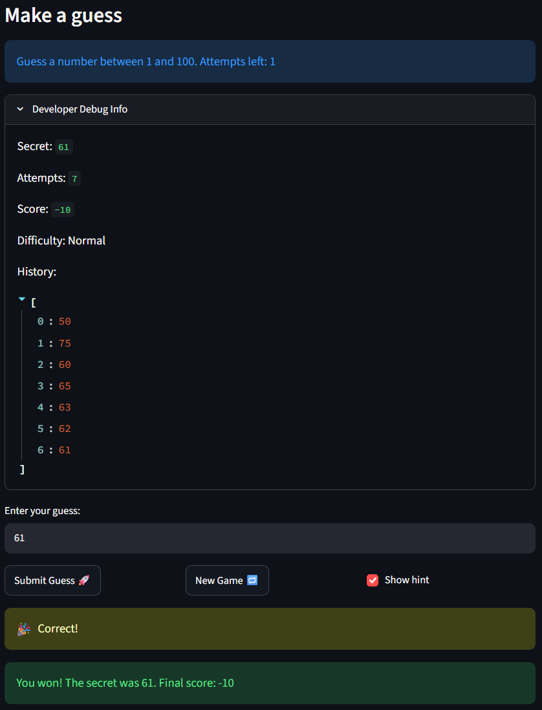

# 🎮 Game Glitch Investigator: The Impossible Guesser

## 🚨 The Situation

You asked an AI to build a simple "Number Guessing Game" using Streamlit.
It wrote the code, ran away, and now the game is unplayable. 

- You can't win.
- The hints lie to you.
- The secret number seems to have commitment issues.

## 🛠️ Setup

1. Install dependencies: `pip install -r requirements.txt`
2. Run the broken app: `python -m streamlit run app.py`

## 🕵️‍♂️ Your Mission

1. **Play the game.** Open the "Developer Debug Info" tab in the app to see the secret number. Try to win.
2. **Find the State Bug.** Why does the secret number change every time you click "Submit"? Ask ChatGPT: *"How do I keep a variable from resetting in Streamlit when I click a button?"*
3. **Fix the Logic.** The hints ("Higher/Lower") are wrong. Fix them.
4. **Refactor & Test.** - Move the logic into `logic_utils.py`.
   - Run `pytest` in your terminal.
   - Keep fixing until all tests pass!

## 📝 Document Your Experience

- [ ] Describe the game's purpose.

The game's purpose is to test the brain in a fun challenging way, even more fun for the developers

- [ ] Detail which bugs you found.

1. Attempt counter started at 1 and the debug feature loaded the interface before doing the computation which lead to a visual lag in the counter, this didn't effect the game play tho

2. Corrected hint direction, The hint message was missleading and gave the opposing direction

3. Srecret would compare as a string which would give incorrect outputs

4. Too high gave point instead of deducting points

5. New game didnt reset the status and history just changed the secret

6. "1 - 100" was hard coded into the game interface and was misleading

- [ ] Explain what fixes you applied.

1. I changed st.session_state.attempts from starting at 1 to 0

2. Made sure the logic was correct in the Hint Message:

HINT_MESSAGES = {
    "Win": "🎉 Correct!",
    "Too High": "📉 Go LOWER!",
    "Too Low": "📈 Go HIGHER!",
}

3. Srecret would compare as a string which would give incorrect outputs:

if st.session_state.attempts % 2 == 0:
    secret = str(st.session_state.secret)
else:
    secret = st.session_state.secret

Removed this function completely the logic did align


4. Too high gave point instead of deducting points:

# before
if outcome == "Too High":
    if attempt_number % 2 == 0:
        return current_score + 5   # bug
    return current_score - 5
# after
if outcome == "Too High":
    return current_score - 5


5. New game didnt reset the status and history just changed the secret:

st.session_state.attempts = 0
st.session_state.secret = random.randint(low, high)
st.session_state.status = "playing"      # was missing
st.session_state.history = []            # was missing


6. "1 - 100" was hard coded into the game interface and was misleading, so I changed the code to print f"...between {low} and {high}..."

## 📸 Demo Walkthrough

Describe your fixed game in numbered steps so a reader can follow along without watching a video:

1. User enters a guess of 50
2. Game returns "Too High" > prints "Go Lower"
3. User enters a guess of 25 > "Too High" > Prints "Go Lower"
4. Score updates correctly after each guess
5. Game ends after the correct guess

**Screenshot** *(optional)*: <!-- Insert a screenshot of your fixed, winning game here -->


## 🧪 Test Results

```
tests/test_game_logic.py::test_winning_guess PASSED                                                                                      [  5%]
tests/test_game_logic.py::test_guess_too_high PASSED                                                                                     [ 11%]
tests/test_game_logic.py::test_guess_too_low PASSED                                                                                      [ 16%]
tests/test_game_logic.py::test_guess_too_low_multidigit PASSED                                                                           [ 22%]
tests/test_game_logic.py::test_guess_too_high_multidigit PASSED                                                                          [ 27%]
tests/test_game_logic.py::test_get_range_easy PASSED                                                                                     [ 33%]
tests/test_game_logic.py::test_get_range_normal PASSED                                                                                   [ 38%]
tests/test_game_logic.py::test_get_range_hard PASSED                                                                                     [ 44%]
tests/test_game_logic.py::test_get_range_unknown_defaults_to_normal_range PASSED                                                         [ 50%]
tests/test_game_logic.py::test_parse_guess_valid_int PASSED                                                                              [ 55%]
tests/test_game_logic.py::test_parse_guess_valid_float_truncates PASSED                                                                  [ 61%]
tests/test_game_logic.py::test_parse_guess_empty_string PASSED                                                                           [ 66%]
tests/test_game_logic.py::test_parse_guess_none PASSED                                                                                   [ 72%]
tests/test_game_logic.py::test_parse_guess_non_numeric PASSED                                                                            [ 77%]
tests/test_game_logic.py::test_update_score_win_first_attempt PASSED                                                                     [ 83%]
tests/test_game_logic.py::test_update_score_win_never_drops_below_10 PASSED                                                              [ 88%]
tests/test_game_logic.py::test_update_score_too_high_always_penalizes PASSED                                                             [ 94%]
tests/test_game_logic.py::test_update_score_too_low_always_penalizes PASSED                                                              [100%]
```

## 🚀 Stretch Features

- [ ] [If you choose to complete Challenge 4, describe the Enhanced UI changes here — a screenshot is optional]
